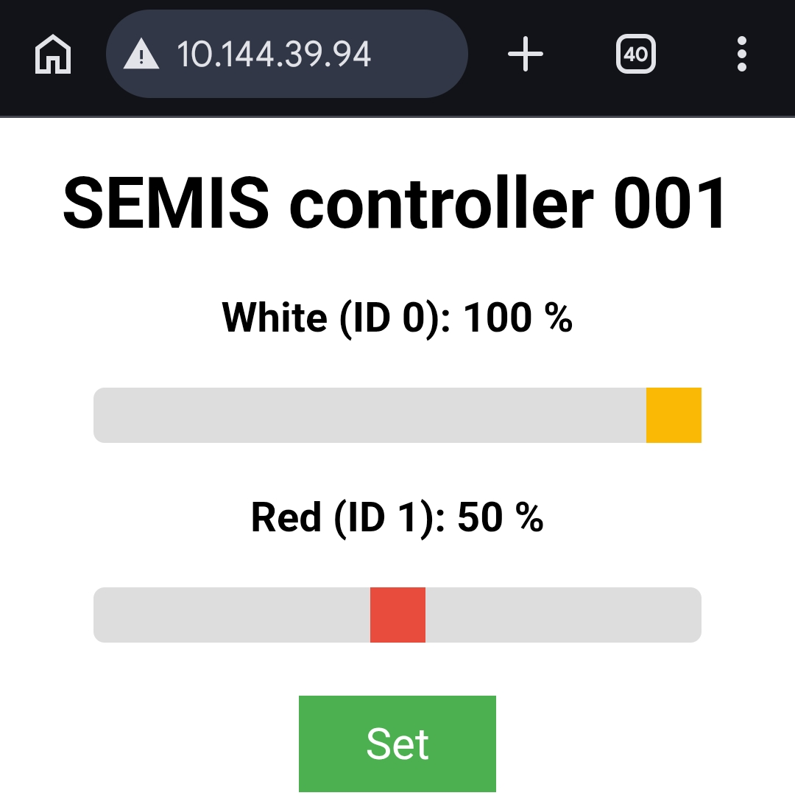
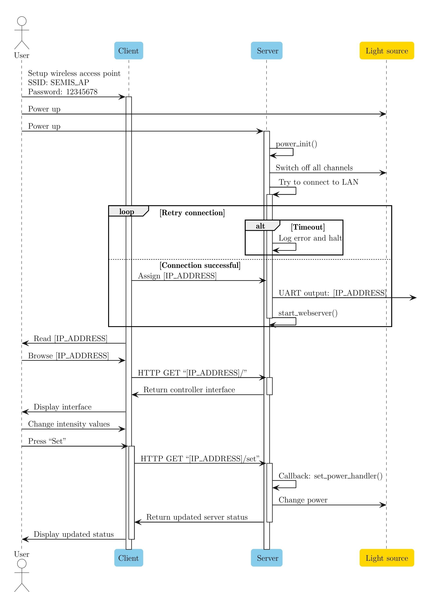

| Supported Targets | ESP32 | ESP32-C2 | ESP32-C3 | ESP32-C5 | ESP32-C6 | ESP32-C61 | ESP32-S2 | ESP32-S3 | ESP32-P4 | ESP32-H2 |
| ----------------- | ----- | -------- | -------- | -------- | --------- | -------- | -------- | -------- | -------- | -------- |

# SEMIS WiFi Controller

This controller provides a user interface to control SEMIS. Once connected to a Local Area Network (LAN), any device connected to the same network can access a SEMIS controller using its IP address, which is accessible through network discovery and also printed via the serial comm port of the ESP32 board.

## Hardware dependencies

Hardware and software must be compatible. Pay attention to the necessary software adjustments while replacing crucial components, i.e., DACs or LED drivers. The current implementation considers the following components:
- [Microchip DAC MCP4802](https://www.microchip.com/en-us/product/mcp4802)
- [Sparkfun PicoBuck LED Driver](https://www.sparkfun.com/picobuck-led-driver.html)

Wiring of the components is shown in the [report](../../Documentation/Report_03_2026_Alejandro_Guzman.pdf), appendix F. Pay attention to the power requirements and constraints of all components. 

## Configure the project

Open the project configuration menu (`idf.py menuconfig`).

In the `Example Configuration` menu:

* Set the Wi-Fi configuration.
    * Set `WiFi SSID`.
    * Set `WiFi Password`.

Constants defined in [html_helper.c](components/html_helper/html_helper.c) override menuconfig.

The full execusion of the program is shown below in a sequence diagram.

## Build and Flash

Build the project and flash it to the board, then run the monitor tool to view the serial output:

Run `idf.py -p PORT flash monitor` to build, flash and monitor the project.

(To exit the serial monitor, type ``Ctrl-]``.)

## Troubleshooting

For any technical queries, please open an [issue](https://github.com/espressif/esp-idf/issues) on GitHub.

Also, feel free to contact me: [Alejandro Guzmán]()

